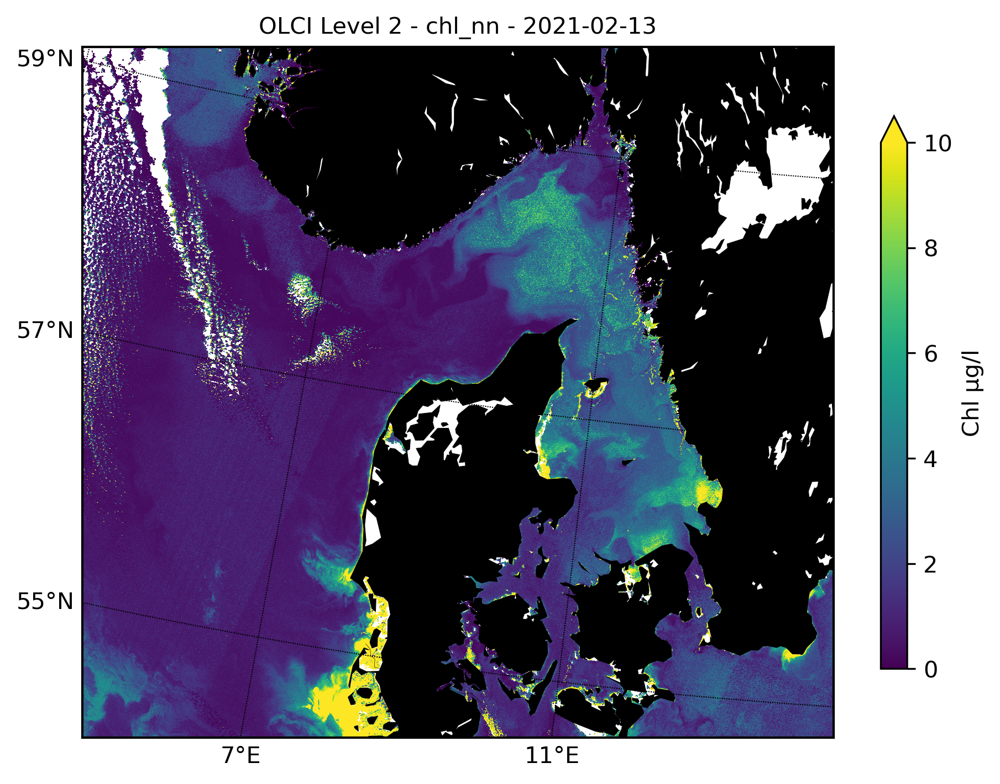
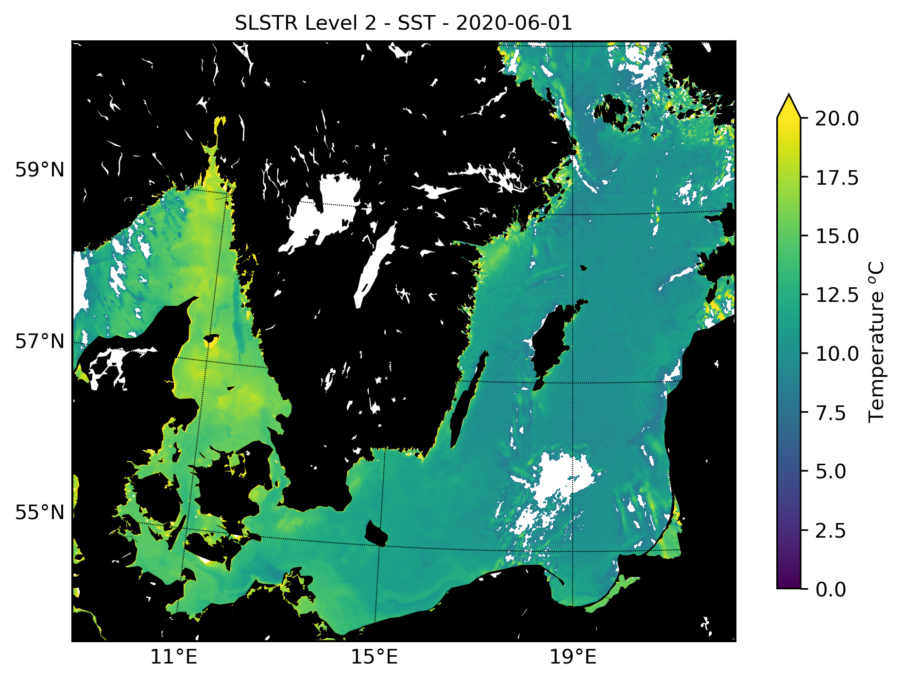

# SenPlot
Basically a place to gather example scripts to plot Sentinel 3 - data (OLCI and SLSTR) using the satpy library.

See senplot/senplot/examples/

Install dependencies
--------

See the [installation docs](https://satpy.readthedocs.io/en/stable/install.html)
for all details regarding Satpy. 
SenPlot depends on the following packages:

- ``satpy``
- ``matplotlib``
- ``basemap``
- ``basemap-data-hires``

Example Chlorophyll
--------

Example Sea Surface Temperature
--------
